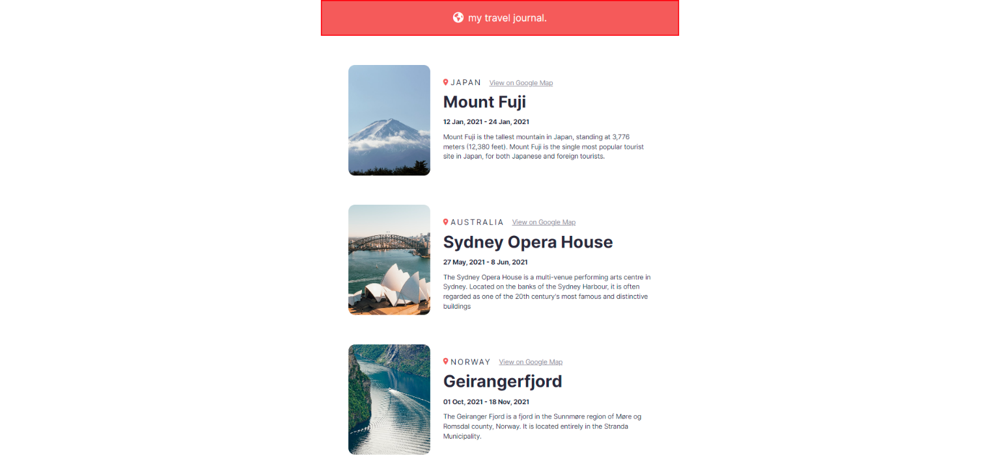

## Table of contents

- [General Info](#general-info)
- [Technologies Used](#technologies-used)
- [Screenshots](#screenshot)
- [Links](#links)
- [What I learned](#what-i-learned)
- [Contacts](#Contact)

## General Info

This is the second React project of the Scrimba course.
[Click Here!](https://scrimba.com/learn/learnreact)

## Technologies Used

- HTML
- CSS
- [Flexbox](https://css-tricks.com/snippets/css/a-guide-to-flexbox/)
- [React](https://reactjs.org/)
- [JavaScript](https://developer.mozilla.org/en-US/docs/Web/JavaScript)

## Screenshot

## Links

- Live Site URL: [https://digital-business-card-ap.netlify.app/]

## What I learned

- Why React?
- JSX
- Custom components
- Styling
- Static Pages

## Contacts

- Linkedin - [@apdev88](https://www.linkedin.com/in/apdev88/)
- Twitter - [@ap\_\_dev](https://twitter.com/ap__dev)
